# Check-up de ambiente e ferramentas de desenvolvimento

Antes de iniciar o desenvolvimento com **[MM4](../../dicionario-banrisul.md#mm4---meta-modelo-versão-4)**, é importante que todas as permissões e ferramental do ambiente estejam devidamente liberados, instalados e configurados. Vamos fazer um _walkthrough_ por todos esses processos e artefatos, entendendo o papel de cada um.

## Autenticação

O Banrisul utiliza o **[ID](../../dicionario-banrisul.md#id---identidade-digital)** como meio de autenticação. Trata-se de um cartão com chip que contém um certificado digital A3 — um dispositivo criptográfico que identifica de forma única o titular — utilizando sua **[Matrícula](../../dicionario-banrisul.md#matrícula)** — permitindo assinaturas digitais e autenticações seguras no ecossistema do Banrisul.

Para o acesso, são necessários uma leitora de cartões, o próprio ID e um **[PIN](../../dicionario-banrisul.md#pin---personal-identification-number)** ativo e configurado, todos fornecidos pelo Banrisul. A emissão é solicitada pelo gestor e concluída presencialmente na **[UDS](../../dicionario-banrisul.md#uds---unidade-de-desenvolvimento-de-sistemas)**, onde o colaborador cria seu PIN. Essa medida assegura maior segurança e rastreabilidade.


**🧾 Verifique:**

- [x] Você possui o ID em mãos, ativo e em funcionamento com o PIN, e uma leitora de cartões devidamente instalada e funcionando na sua máquina?

## Estação de trabalho

A estação de trabalho é o dispositivo que o colaborador utiliza para suas atividades dentro do ecossistema Banrisul.

Ela pode ser física (como por exemplo um notebook), sendo utilizada diretamente ou remotamente por **[RDS](../../dicionario-banrisul.md#rds---remote-desktop-services)** através de uma **[VPN](../../dicionario-banrisul.md#vpn---virtual-private-network)**, ou virtualizada pelo sistema **[VDI](../../dicionario-banrisul.md#vdi---virtual-desktop-infrastructure)**, sendo acessada de forma remota via o aplicativo **Omnissa Horizon Client**.

Essas variações existem para adequar o tipo de acesso ao perfil de trabalho. Seja atuando presencialmente nas dependências do Banrisul ou de forma remota em modelo de trabalho híbrido. O objetivo é sempre preservar os padrões de segurança e conformidade.

Em todos os cenários, a estação de trabalho é o núcleo do ambiente de desenvolvimento, onde estão configurados os sistemas, ferramentas e permissões necessárias para o trabalho seguro dentro do ecossistema.

**🧾 Verifique:**

- [x] Qual é a sua modalidade atual de acesso? Física direta, física remota ou virtualizada?

### Estação física direta

A estação física direta é o notebook ou desktop utilizado diretamente nas dependências do Banrisul — sem uso de sistemas de conexão remota. Esse é o modo de trabalho de colaboradores em rotina presencial, cujo equipamento está conectado diretamente à rede interna do Banrisul.

Nesses casos, a autenticação é feita também com o ID, e todas as ferramentas básicas já estão pré-instaladas conforme o perfil do usuário.

Esse tipo de estação oferece maior desempenho e acesso direto a recursos de rede, sendo ideal para tarefas que exigem alto poder de processamento ou dependência de hardware específico.

**🧾 Verifique:**

- [x] Se sua modalidade é através de uma estação física direta, você a tem?
- [x] Consegue logar nela com seu ID? Ela possui acesso funcional à rede do Banrisul?

### Estação física remota

A estação física remota nada mais é do que a mesma estação física direta, porém configurada e liberada para ser acessada remotamente a partir de dispositivos fora das dependências do Banrisul.

Em muitos casos de modelo de trabalho híbrido, colaboradores que estão fora das dependências do Banrisul acessam remotamente a estação física através de outros dispositivos, e quando estão presenciais nas dependências do Banrisul, ou utilizam a estação física diretamente, ou a acessam de outras máquinas internas da rede.

No caso de acessos remotos através de pontos externos à rede do Banrisul, o acesso é feito por meio de uma VPN utilizando o **Cisco AnyConnect**, que estabelece um tunelamento criptografado entre o dispositivo e a rede interna do Banrisul. Após, é utilizada a **Conexão de Área de Trabalho Remota do Windows (RDP)** para se abrir a sessão na estação de fato, cujo endereço é estabelecido através de um **[Nome de patrimônio](../../dicionario-banrisul.md#nome-de-patrimônio)** fornecido pelo Banrisul — você interage com ela de forma remota — sua tela, teclado, mouse e recursos de som são transmitidos pelo tunelamento, garantindo total isolamento entre o seu dispositivo e o ecossistema do Banrisul.

Cisco AnyConnect:

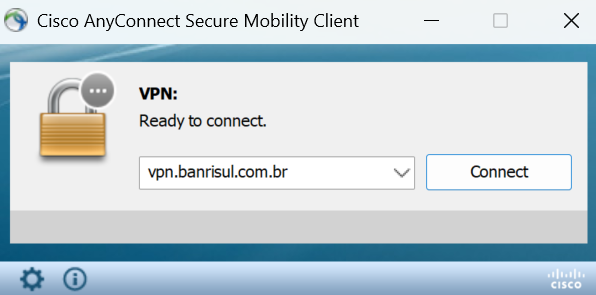

Conexão de Área de Trabalho Remota do Windows:

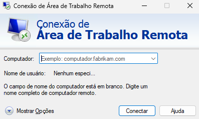

Essa modalidade é comum em casos de desenvolvimento que exigem hardware dedicado, como testes em emuladores para aplicações móveis ou setups específicos que não podem ser reproduzidos em VDI.

> Nota: Enquanto a VPN estiver ativa na sua máquina (fazendo tunelamento com a rede interna do Banrisul), você ficará completamente sem acesso á internet.

**🧾 Verifique:**

- [x] Se sua modalidade é através de uma estação física remota, você tem o **Cisco AnyConnect** instalado, configurado e funcional?
- [x] Sua VPN permite conexão através do ID com a opção `VPN_COM_ID-DIGITAL`?
- [x] Você já possui o nome do patrimônio?
- [x] Tendo a conexão com a VPN estabelecida, consegue alcançar a máquina remota por RDP através de seu nome de patrimônio?
- [x] Consegue logar nela com seu ID?

### Estação virtualizada

A estação virtualizada é um dispositivo pertencente ao sistema VDI, que consiste de máquinas virtuais hospedadas diretamente na infraestrutura do Banrisul, acessadas por meio do aplicativo **Omnissa Horizon Client**.

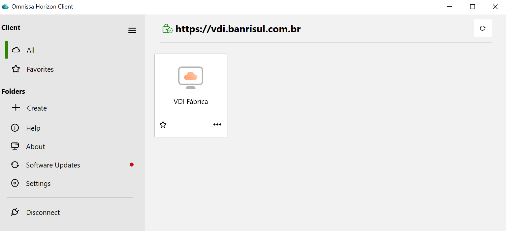

Uma máquina de VDI funciona como uma estação de trabalho completa, mas que roda dentro dos servidores do banco, e não no seu computador local. Semelhante às conexões por VPN e RDP, você também interage com ela de forma remota — tela, teclado, mouse e recursos de som são transmitidos por uma sessão criptografada, garantindo total isolamento entre o seu dispositivo e o ecossistema do Banrisul.

Esse modelo assegura maior segurança, uniformidade e controle centralizado: todos os colaboradores acessam ambientes idênticos, pré-configurados pelo Banrisul, com ferramentas padronizadas e atualização simplificada. Nenhum dado corporativo é armazenado localmente, eliminando riscos de vazamento e inconsistências entre ambientes.

**🧾 Verifique:**

- [x] Se sua modalidade é através de VDI, você tem o **Omnissa Horizon Client** instalado?
- [x] Ao abrir o aplicativo, sua estação de trabalho virtual está disponível e acessível?
- [x] Consegue logar nela com seu ID?

## Central de software

A central de software é o portal corporativo de distribuição e gerenciamento de aplicações dentro do ecossistema do Banrisul. Ela funciona como uma loja interna de softwares homologados, onde cada colaborador pode consultar e instalar as aplicações liberadas para o seu perfil — de forma segura, rastreável e compatível com as políticas de TI da instituição.

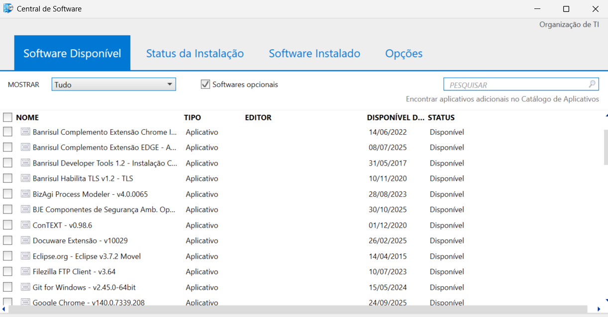

Centrais de software são muito comuns em grandes corporações pelo mundo — é um padrão altamente adotado para substituir a instalação manual de programas por um sistema padronizado, automatizado e com gerenciamento refinado.

Ao invés de baixar executáveis da internet, o colaborador utiliza a central para instalar versões oficiais e validadas previamente pelo time de segurança e infraestrutura. Dessa forma, a organização mantém controle sobre:

- **O que** está instalado em cada máquina;
- **Quem** instalou determinada aplicação;
- **Quando** a aplicação foi instalada;
- **Quais versões** da aplicação estão em uso;
- **Quais dependências** da aplicação necessitam gerenciamento.

**🧾 Verifique:**

- [x] Você consegue abrir a central de software na sua estação?
- [x] As aplicações listadas estão sendo carregadas corretamente?
- [x] Consegue iniciar a instalação de alguma aplicação sem erros?

## Ferramentas de apoio ao desenvolvimento - PZP

O **[PZP](../../dicionario-banrisul.md#pzp---ferramenta-de-apoio-ao-desenvolvimento)** é uma aplicação central que reúne as principais ferramentas de apoio ao desenvolvimento utilizadas no ecossistema do Banrisul.

Ele funciona como um **hub de produtividade**, concentrando em um único local todos os utilitários que compõem a experiência do desenvolvedor — desde geradores de código, validadores e testadores, até ferramentas de integração com bases de dados, automação e manutenção de sistemas.

Em termos práticos, o PZP é o cinturão de utilidades do desenvolvedor, agregando as funcionalidades personalizadas do framework MM4 (e também dos demais MMs), permitindo que o time de desenvolvimento realize suas tarefas com mais eficiência, consistência e segurança.

Através dele é possível acessar scripts, executores, consultas, componentes de geração e módulos de suporte, sem depender de instalações externas.

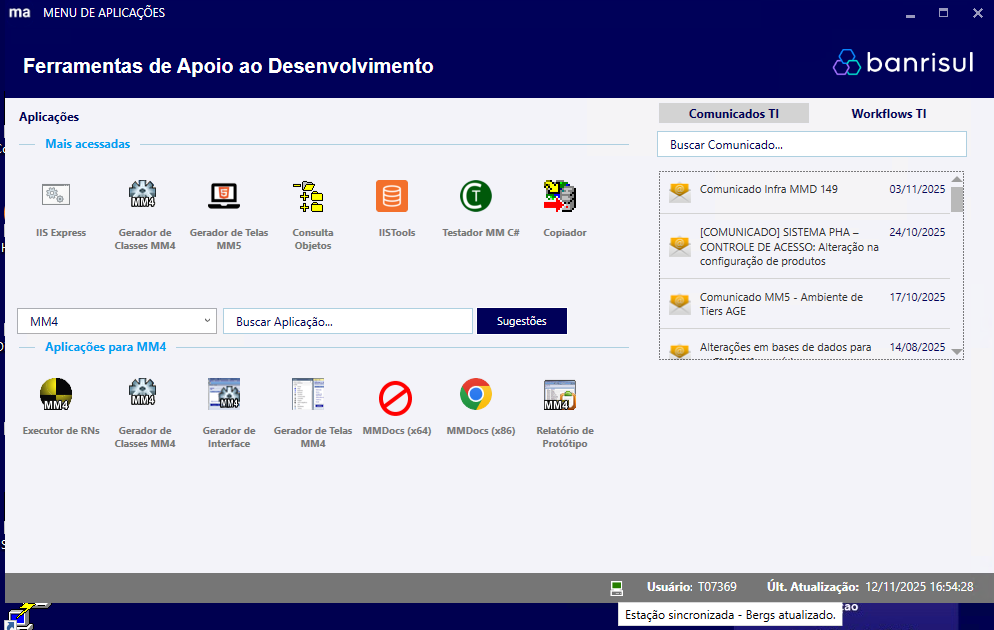

> Nota: Perceba o **computador verde** no rodapé da aplicação. Passando o mouse em cima deste computador, é exibida a mensagem `Estação sincronizada - Bergs atualizado`.

**🧾 Verifique:**

- [x] Você consegue abrir o PZP na sua estação?
- [x] O status do PZP consta como `Estação sincronizada - Bergs atualizado`?
- [x] Ele exibe com sucesso os utilitários quando você seleciona a categoria `MM4`?

## Consulta Objetos

O **[Consulta Objetos](../../dicionario-banrisul.md#consulta-objetos)** é um **[SGDB](../../dicionario-banrisul.md#sgdb)** que centraliza o acesso e a gestão de dados nos bancos de dados corporativos do Banrisul, como **DB2 (IBM)** e **Oracle**. Ele atua como um cliente de acesso a bancos de dados, permitindo ao colaborador consultar, criar, atualizar e eliminar informações diretamente nos ambientes de desenvolvimento e produção, conforme as permissões concedidas.

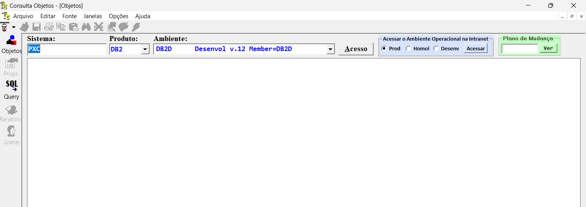

### Permissões e autenticação

Para acessar o Consulta Objetos, é necessário possuir uma senha gerada no **[DROSCOE](../../dicionario-banrisul.md#droscoe)**, dentro do **[Computador Central](../../dicionario-banrisul.md#computador-central)**, por meio de uma outra senha, a senha temporária **[RACF](../../dicionario-banrisul.md#racf---resource-access-control-facility)** fornecida pelo Banrisul.

Além disso, o usuário deve ter as permissões adequadas nas tabelas do banco de dados alvo — através de permissões solicitadas no **[BOP](../../dicionario-banrisul.md#bop) Web** para seleção, inclusão, alteração e deleção de registros.

BOP Web:

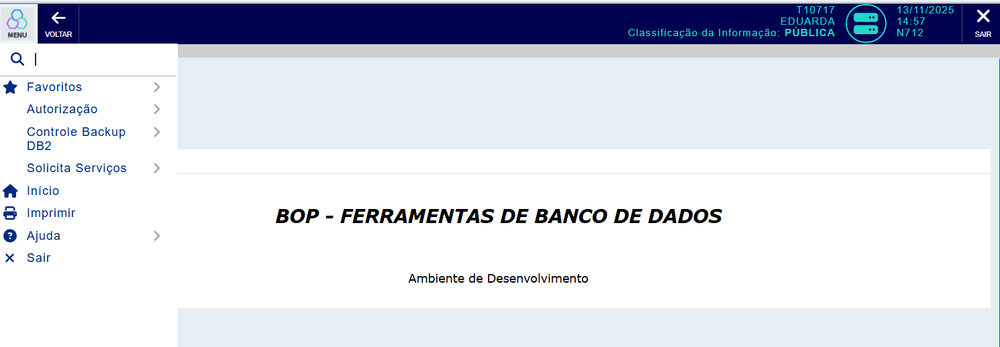

**🧾 Verifique:**

- [x] Você consegue abrir o Consulta Objetos pelo PZP na sua estação?
- [x] Consegue interagir com as tabelas `PXC.IDIOMA`, `PXC.CLIENTE_PXC` e `PXC.CONTRATO` através das queries do Consulta Objetos?

## Ambiente operacional

O Ambiente Operacional do Banrisul é composto por uma **tríade de espaços de execução** que suportam o ciclo completo das aplicações corporativas — desde o desenvolvimento e testes até a operação real em produção.
Cada um desses ambientes tem papel fundamental na estabilidade, segurança e continuidade dos serviços internos e externos.

Essa tríade é formada por:

- Ambiente **Local** - Instalado na própria estação do colaborador, destinado ao **desenvolvimento individual e testes isolados**, sem impacto em outros sistemas ou usuários.
- Ambiente de **Desenvolvimento** (também chamado [MMDesenv](../../dicionario-banrisul.md#mmdesenv---ambiente-operacional-de-desenvolvimento)) - Espaço **compartilhado entre equipes**, voltado a testes integrados, validações colaborativas e execução de aplicações internas de menor criticidade.
- Ambiente de **Produção** - Destinado às **operações corporativas reais**, abrigando aplicações e serviços críticos que suportam as atividades do dia a dia, tanto internas (ex.: workflows) quanto externas (ex.: transações de clientes).

Ambiente operacional de desenvolvimento:

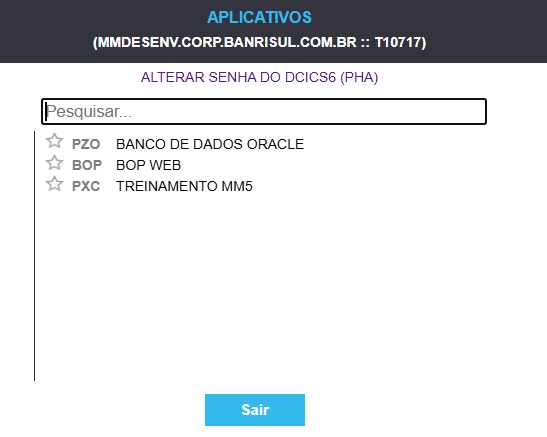

Ambiente operacional de produção:

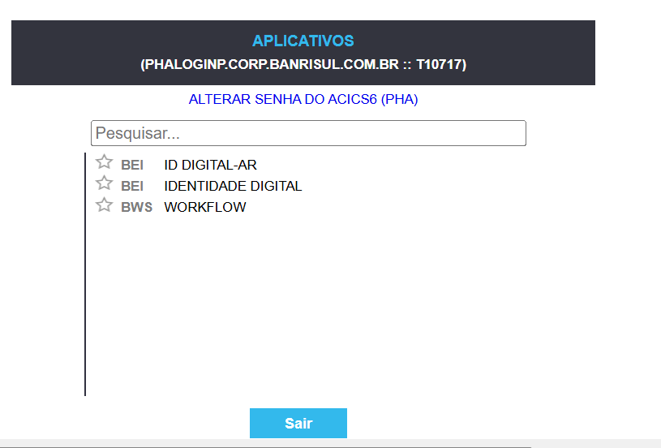

> Nota: O ambiente operacional local não será necessário nesse momento, e demandará configurações adicionais, que serão abordadas no **Curso Framework MM5 Banrisul**.

**🧾 Verifique:**

- [x] No navegador, você consegue abrir o ambiente de produção (<https://intranet.corp.banrisul.com.br/bus/link/login_ambiente_operacional.html>) e logar com o seu ID (Matrícula e PIN)?
- [x] Consegue fazer o mesmo no ambiente de desenvolvimento (<https://mmdesenv.corp.banrisul.com.br/pwx/>)?

## PXC - Treinamento MM5

Antes de avançar, é importante entender que **[PXC](../../dicionario-banrisul.md#pxc)** é uma sigla de sistema, também denominada **[CSS](../../dicionario-banrisul.md#css---código-de-sigla-de-sistema)**.

### CSS

O CSS é um **identificador único e padronizado** atribuído a cada sistema desenvolvido dentro do Banrisul.

Esse código é composto por **três letras** e serve como referência central ao sistema em todo o ecossistema do Banrisul — incluindo autenticação, logs, bancos de dados, pipelines, arquiteturas, documentação técnica, entre outros aspectos.

A definição do CSS ocorre na fase inicial de concepção do sistema, sendo de responsabilidade do(s) analista(s) ou arquiteto(s) de solução envolvidos no projeto.

A escolha das letras deve seguir critérios que garantam clareza, unicidade e coerência dentro do ecossistema, levando em consideração aspectos como:

- **Acessibilidade** - Se o sistema é interno, externo ou híbrido;
- **Público-alvo** - Colaboradores, clientes, parceiros, etc.;
- **Propósito e domínio de negócio** - Qual área ou processo o sistema atende;
- **Permissões e segurança** - Níveis de acesso e criticidade da aplicação;
- **Contexto organizacional** - Integração com outros sistemas ou módulos existentes.

Em suma, o CSS funciona como a **identidade técnica oficial** do sistema dentro do Banrisul — uma espécie de "apelido institucional" que permite sua rastreabilidade, integração e documentação padronizada em todos os níveis do ecossistema.

### CSS `PXC` - Treinamento MM5

O produto (iniciativa) **Treinamento MM5** faz parte do sistema `PXC`, responsável por centralizar as ações de capacitação técnica e educacional corporativa do Banrisul.

Esse produto atua como _chave de habilitação_ dentro do ecossistema do Banrisul, permitindo o uso de recursos específicos que são requeridos durante as atividades efetuadas em meio ao **Curso Framework MM4 Banrisul** e ao **Curso Framework MM5 Banrisul**. Ter permissão de acesso a esse produto garante que todas as funcionalidades de desenvolvimento estejam devidamente liberadas para a execução das atividades e exercícios.

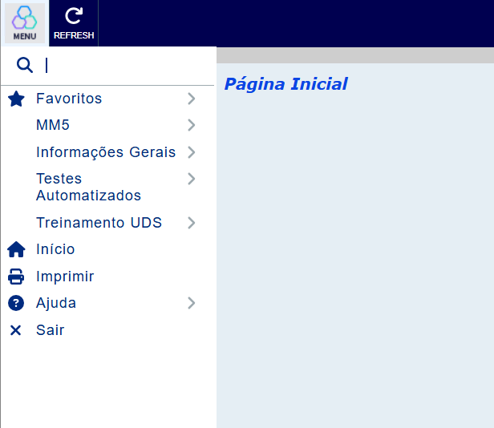

**🧾 Verifique:**

- [x] No navegador, logando no ambiente de desenvolvimento (<https://mmdesenv.corp.banrisul.com.br/pwx/>), a opção de menu `PXC  Treinamento MM5` é exibida?

## Pastas de desenvolvimento

A estruturação correta das pastas de desenvolvimento é um dos componentes essenciais para o funcionamento correto do ambiente de trabalho dentro do Banrisul.

Essas pastas determinam **onde códigos gerados são colocados, onde códigos-fonte são mantidos (desenvolvidos) e onde binários gerados são produzidos** — garantindo que todas as ferramentas do ambiente consigam sincronizar e localizar os recursos necessários durante o ciclo de desenvolvimento e testes.

A organização dessas pastas é padronizada para todos os sistemas e segue uma lógica de integração entre três principais locais:

- **C:\\Genhome**;
- **C:\\Desenvhome**;
- **C:\\Soft**.

Dentro de cada pasta, convencionalmente são criadas as subpastas respectivas aos CSSs. Para o caso dos treinamentos, como vamos trabalhar com o sistema `PXC`, teremos a pasta `PXC` dentro de cada uma delas.

### Genhome

A pasta `Genhome` é utilizada como **espaço temporário intermediário** para os arquivos gerados pelas ferramentas de geração de código-fonte do framework MM4 (contidas no PZP). Ela serve como um ambiente de revisão, para que o colaborador cheque e valide o conteúdo gerado antes de integrá-lo ao espaço principal de desenvolvimento (`Desenvhome`).

Quando o conteúdo estiver checado e validado, deve ser **movido manualmente** para a respectiva pasta do sistema (CSS) dentro de `Desenvhome`.

A pasta `Genhome` deve conter uma subpasta `PXC` referente ao CSS de treinamentos:

```makefile
C:\
└── Genhome\
    ├── PXC\
    └── Outras pastas de CSS...
```

### Desenvhome

A pasta `Desenvhome` é o **espaço principal de desenvolvimento**, onde ficam os projetos ativos e o código-fonte em edição. Ela é monitorada por rotinas internas de sincronização, responsáveis por obter automaticamente os produtos de compilação (build) e enviar os binários gerados para o espaço de provisionamento em ambiente local (`Soft`).

A pasta `Desenvhome` deve conter uma subpasta `PXC` referente ao CSS de treinamentos, e, opcionalmente, recomendamos também uma pasta `LABS`, para armazenar seus próprios experimentos, [PoC](../../dicionario-banrisul.md#poc---proof-of-concept)s e testes independentes.

```makefile
C:\
└── Desenvhome\
    ├── LABS\
    ├── PXC\
    └── Outras pastas de CSS...
```

### Soft

A pasta `Soft` é o **espaço de provisionamento em ambiente local** — ou seja, é o ponto onde os produtos de compilação (build) das aplicações são armazenados para que os servidores de aplicação possam executá-los e disponibilizá-los para teste através do **Ambiente Operacional Local**.

A pasta `Soft` deve conter uma subpasta `PXC` referente ao CSS de treinamentos, e, neste caso, a pasta `PXC` por si só também precisa de duas subpastas:

- **DATA** - Armazena arquivos gerados em tempo de execução, como relatórios, logs e exportações;
  > Nota: A ausência dessa pasta pode causar exceções durante o uso do método `Imprimir` do sistema.
- **MULTIMIDIA** - Contém arquivos de mídia utilizados pelas aplicações, como imagens, ícones, vídeos ou arquivos de áudio.

```makefile
C:\
└── Soft\
    ├── PXC\
    │   ├── DATA\
    │   └── MULTIMIDIA\
    └── Outras pastas de CSS...
```

### Relação entre as pastas

```makefile
C:\
├── Desenvhome\
│   ├── LABS\
│   ├── PXC\
│   └── Outras pastas de CSS...
│
├── Genhome\
│   ├── PXC\
│   └── Outras pastas de CSS...
│
└── Soft\
    ├── PXC\
    │   ├── DATA\
    │   └── MULTIMIDIA\
    └── Outras pastas de CSS...
```

O fluxo entre as pastas pode ser resumido da seguinte forma:

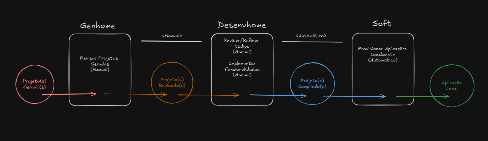

**🧾 Verifique:**

- [x] Em `C:` as pastas `Genhome`, `Desenvhome` e `Soft` estão presentes?
- [x] Dentro de cada uma delas a subpasta `PXC` está presente?
- [x] Dentro de `C:\Soft\PXC` as subpastas `DATA` e `MULTIMIDIA` estão presentes?
- [x] Dentro de `C:\Desenvhome` a pasta opcional `LABS` está presente?

## Aplicações pré-requisito

Para tornar sua estação de trabalho apta ao desenvolvimento de aplicações backend com MM4, as seguintes ferramentas são necessárias através da central de software:

### Bancos de dados

- `=` **IBM DB2 Connect - v11.5.8** - Conector responsável por gerenciar o acesso às fontes de dados IBM DB2 nas aplicações.

### Suporte a aplicações backend

- `=` **Microsoft .NET Framework Developer Pack - v4.8** - Runtime e bibliotecas do .NET Framework clássico. Necessário para compilar e executar aplicações MM4 que rodam sobre o CLR 4.x;
- `=` **Microsoft ANCM - .NET Runtime + SDK - IISExpress 10 - v8.0.1** - O ASP.NET Core Module (ANCM) permite que o [IIS](../../dicionario-banrisul.md#iis---internet-information-services) (ou IIS Express) hospede aplicações modernas em .NET Core ou .NET 5+. Essa versão suporta aplicações que executam sobre o CoreCLR 6.x ou posterior (com compatibilidade parcial para .NET 5.x). Mesmo que o MM4 não o utilize diretamente, sua instalação garante compatibilidade com ferramentas e integrações de outras aplicações já modernizadas.

### IDEs

- `=` **Microsoft Visual Studio 2017 Express Desktop - v15.9.7** - [IDE](../../dicionario-banrisul.md#ide---integrated-development-environment) oficial para desenvolvimento e debug das aplicações MM4.

**🧾 Verifique:**

- [x] Você tem todas as ferramentas descritas acima instaladas na central de software?
- [x] O Visual Studio já está registrado com a sua conta de colaborador ou a conta genérica de treinamentos (<sistema_pwx@banrisul.com.br>)?
